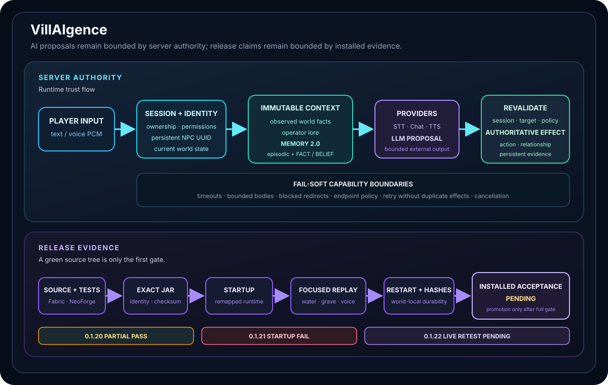

# VillAIgence — server-authoritative AI society for Minecraft

**VillAIgence** is an MCA-derived Minecraft 1.21.1 mod that grew from AI-assisted villager dialogue into an experiment in persistent NPC society: text and voice interaction, Memory 2.0, relationships, operator-authored context and bounded server-owned actions.


[GitHub repository ↗](https://github.com/True-Ruslan/villAIgence)

The internal `LivingWorld / livingworld` names remain compatibility-sensitive engine, configuration and world-data identities. The public project name changed without silently renaming the `mca` mod id, Java package root or `<world>/livingworld/` storage.



## At a glance

<dl class="tr-project-glance" data-tr-project-glance="livingworld">
<dt>My contribution</dt>
<dd>Architecture for the server-authoritative AI/NPC system, Memory 2.0, provider boundaries and release engineering.</dd>
<dt>Stack</dt>
<dd>Java 21 · Fabric · Minecraft 1.21.1 · Voice/STT/TTS · Memory 2.0</dd>
<dt>Challenge</dt>
<dd>Make AI-driven NPCs convincing without giving the model authority over world state, memory or actions.</dd>
<dt>Result</dt>
<dd>Official 0.3.2+1.21.1 is published after the exact installed 0.3.1 corrective canary failed; the 0.3.2 installed retest remains PENDING, so release-candidate acceptance is still in progress.</dd>
<dt>Status</dt>
<dd><span data-tr-project-status="livingworld"></span></dd>
</dl>

<!-- case-study:problem -->
## Problem: a convincing NPC must still obey the server

The provider call is not the hardest part. The system must decide who owns a conversation, which context was actually observed, what the NPC may remember, whether an asynchronous answer is still current and where an LLM proposal ends before an authoritative game mutation begins.

> The server owns identity, context, memory, relationships, actions and persistent evidence. The model may propose; it never becomes the authority.

Release evidence has the same boundary problem. A green source pipeline does not automatically prove that the exact remapped JAR starts, saves, restarts and survives the installed scenarios expected from the product.

<!-- case-study:constraints -->
## Constraints and risks

### Mutable game state cannot leak into asynchronous work

STT, Chat and TTS may finish after the session, player or NPC state has changed. The server captures an immutable bounded context before provider work and revalidates current state before applying any result.

### Text and voice share one conversation core

```text
voice PCM → STT → validated message ┐
                                     ├→ context → Chat → response → optional TTS
text command → validated message ────┘
```

Voice is transport. A failed TTS stage must not erase a useful text response, and retries must not duplicate persistent side effects.

### Memory 2.0 separates event, belief and authority

`memory2.json` is the persistent dialogue-memory source after the 0.2 clean cutover. Episodic events record what happened. Semantic memory distinguishes `FACT` from `BELIEF`. `PLAYER_TOLD`, `NPC_TOLD` and `INFERRED` claims remain beliefs; authoritative facts require server-owned `SYSTEM_OBSERVED` evidence.

### Provider, release and installed proof remain layered

Authenticated redirects, unsafe endpoints, malformed JSON, oversized bodies and unbounded waits fail closed. Source tests, GameTests, exact production-JAR startup/restart, package identity, release publication and installed acceptance answer different questions.

<!-- case-study:current-state -->
## Current lifecycle and acceptance boundary

The public lifecycle remains **release-candidate — ACCEPTANCE IN PROGRESS**. The current official release is **0.3.2+1.21.1**. The exact official 0.3.1 installed **VAI-PCM-MULTI-001** canary failed on Muammer recall while Nurey recall, persistence validity, event uniqueness and cross-NPC isolation remained intact. **PR #169** merged the narrow deterministic targeted-recall ranking correction, and **PR #171** records the exact retained-world handoff for the official 0.3.2 installed retest. Automated 0.3.2 release gates pass, but the 0.3.2 installed corrective canary is still **PENDING**.

The last installed baseline with completed acceptance remains the historical **0.2.0+1.21.1 — 7 PASS / 0 FAIL**. The failed 0.3.1 installed canary is negative evidence, and publishing 0.3.2 does not rewrite it or imply an installed PASS for the new corrective bytes. **VAI-M2-INST-005** remains NOT TESTED / automated evidence only and **VAI-CONCUR-004** remains NOT TESTED / DEFERRED.

Until the 0.3.2 corrective canary has real installed PASS evidence, **0.4 remains blocked**. Release identity, merged source capability, automated release gates and installed gameplay acceptance remain separate facts.

<!-- case-study:decisions -->
## Architecture and key decisions

### Server-owned session and immutable context

A conversation begins with an authoritative `player ↔ NPC` session. Text or voice is accepted only inside that session. The server captures bounded identity, observed facts, operator lore and memory, then revalidates the session and world before an answer can affect state.

### Candidate extraction, admission and truth are separate stages

A parsed candidate is not semantic memory by itself. PR #123 defines admission; PR #125 explores extraction. The server supplies provenance and source identity, while FACT still requires current server-observed evidence. This keeps model output useful without turning model confidence into truth authority.

### Operator Lore remains background context

The client editor never owns files or arbitrary identities. Permission checks, trusted target resolution, revision conflicts and atomic world-local writes remain server-authoritative. Operator lore is not automatically promoted into semantic FACT.

### Capability-level degradation preserves useful results

PR #110 established one shared monotonic voice-turn budget. A successful Chat result can remain committed exactly once when optional TTS exhausts the remaining budget; retries do not replay dialogue or relationship effects.

### Clean cutover beat indefinite dual persistence

Before 0.2, dialogue had a legacy persistence path alongside Memory 2.0. The pre-1.0 project deliberately chose a clean cutover instead of inventing a speculative semantic migration from old transcripts. Installed acceptance then validated the new model on exact bytes.

### Release identity is product state

A filename version is insufficient. Embedded metadata, package structure and checksums must agree. The installed 0.2 candidate is byte-identical to the final release candidate, so documentation-only acceptance-oracle corrections do not require rerunning the same runtime bytes.

## Real failures that changed the system

The installed `0.1.20+1.21.1` candidate ended as a **partial PASS**: water navigation, filled-grave handling, release identity and extreme Chat latency exposed independent defects.

The following `0.1.21+1.21.1` candidate failed during startup because a tombstone Mixin could not resolve its production target. Safe rollback restored service and preserved persistent data.

Later, the physical STT seed `silver-fox-482` was recognized as `SilverFox482` during the 0.2 clean-world test. Memory persisted and reproduced the accepted STT transcript correctly. The acceptance oracle was corrected: persistence is evaluated from the accepted transcript boundary, while punctuation/case normalization remains an STT-quality observation.

The exact official `0.3.1+1.21.1` corrective candidate then exposed a deeper retrieval-ranking failure: Muammer retained the owner-local `amber-pine-314` event but did not recall it after the required exact query. That negative installed evidence led to the narrow deterministic ranking correction in PR #169 rather than a broader authority, persistence or provider change.

<!-- case-study:alternatives -->
## Alternatives considered and rejected

### Client-owned authority

Rejected. The client may request and display an interaction, but it cannot own NPC identity, facts, relationships or world mutations.

### Transcript-only memory

Rejected. A single message list cannot represent provenance, semantic FACT/BELIEF, actions, relationship changes and deterministic retention.

### LLM-created FACT or confidence-based promotion

Rejected. `PLAYER_TOLD`, `NPC_TOLD` and `INFERRED` remain BELIEF. FACT requires `SYSTEM_OBSERVED` evidence owned by the server.

### A second provider request for semantic extraction

Rejected for PR #125. Candidate extraction must reuse the bounded structured Chat response, avoiding a second latency/cost/truth surface.

### Source CI as release acceptance

Rejected. Exact package identity, startup, restart, persistent read-back and installed acceptance require separate gates.

### Literal-loopback proof as external-provider quality proof

Rejected. Deterministic loopback is a protocol/client boundary, not evidence about external provider quality, microphone capture or subjective playback.

<!-- case-study:evidence -->
## Evidence boundary

The complete Project Evidence snapshot and timeline remain on the [Russian canonical VillAIgence page](../../landing/projects/livingworld.md). They are generated from shared registries rather than copied into a second English evidence model.

The current bounded snapshot separates the historical `0.2.0+1.21.1` installed **7 PASS / 0 FAIL** baseline, the failed exact installed **0.3.1+1.21.1 VAI-PCM-MULTI-001** canary and the official **0.3.2+1.21.1** corrective release. **PR #169** is the deterministic targeted-recall ranking correction and **PR #171** is the exact retained-world 0.3.2 installed retest handoff. The 0.3.2 **VAI-PCM-MULTI-001** canary is still **PENDING**. **0.4 remains blocked** until that real installed acceptance exists. Deferred `VAI-M2-INST-005` and `VAI-CONCUR-004` boundaries remain explicit.

<!-- case-study:limitations -->
## Known limitations

- the exact installed `VAI-PCM-MULTI-001` canary for official 0.3.2 remains **PENDING** after the 0.3.1 installed FAIL;
- `VAI-M2-INST-005` remains NOT TESTED / automated evidence only;
- `VAI-CONCUR-004` remains NOT TESTED / deferred;
- physical microphone/provider/Voice Chat quality remains observational evidence separate from deterministic protocol tests;
- publishing 0.3.2 and passing automated release gates do not prove installed corrective acceptance;
- semantic BELIEF admission and the recall correction do not permit AI→FACT authority;
- publication does not automatically promote the public lifecycle beyond release-candidate;
- Fabric remains the primary package while NeoForge is a compatibility build with separate boundaries.

<!-- case-study:next -->
## Next accepted milestone

Run the **exact 0.3.2 installed VAI-PCM-MULTI-001 corrective canary** defined by PR #171.

Install the official `0.3.2+1.21.1` Fabric JAR, verify SHA-256 `b51cfcf3f46718fac9620586cf8b5aae53356c600d5ac375ca3280050befe015`, reuse the retained crowded-history world and execute the exact Muammer/Nurey marker baseline, exact recall prompts, cross-NPC isolation and duplicate-event integrity procedure. Only real installed PASS evidence may close the corrective boundary and unblock 0.4.

Until then the lifecycle remains `release-candidate / ACCEPTANCE IN PROGRESS`; source, release and installed evidence are not collapsed into one status.

<!-- case-study:related -->
## Related material

- [Designing a server-authoritative AI NPC pipeline →](../notes/server-authoritative-ai-npcs.md)
- [Why successful LLM output still may violate the contract →](../notes/llm-output-is-a-protocol-boundary.md)
- [From source tests to installed acceptance →](../../landing/notes/source-tests-to-installed-acceptance.md)
- [Probabilistic proposals and deterministic authority →](../../landing/notes/probabilistic-proposals-deterministic-authority.md)
- [Restart persistence as a product contract →](../../landing/notes/restart-persistence-is-a-product-contract.md)
- [Russian canonical evidence and timeline →](../../landing/projects/livingworld.md)
- [GitHub repository ↗](https://github.com/True-Ruslan/villAIgence)

<!-- case-study:retrospective -->
## What I would change if I started today

I would define the complete authority map before deep provider integration:

```text
mutable server state
→ immutable bounded snapshot
→ external proposal
→ current-state revalidation
→ authoritative effect
```

I would separate episodic and semantic memory from the first version, establish the release gate before the first public candidate and explicitly model **candidate extraction → admission → semantic storage → authority** as separate stages. That separation makes Memory 2.0 more capable without making the LLM a hidden source of truth.
