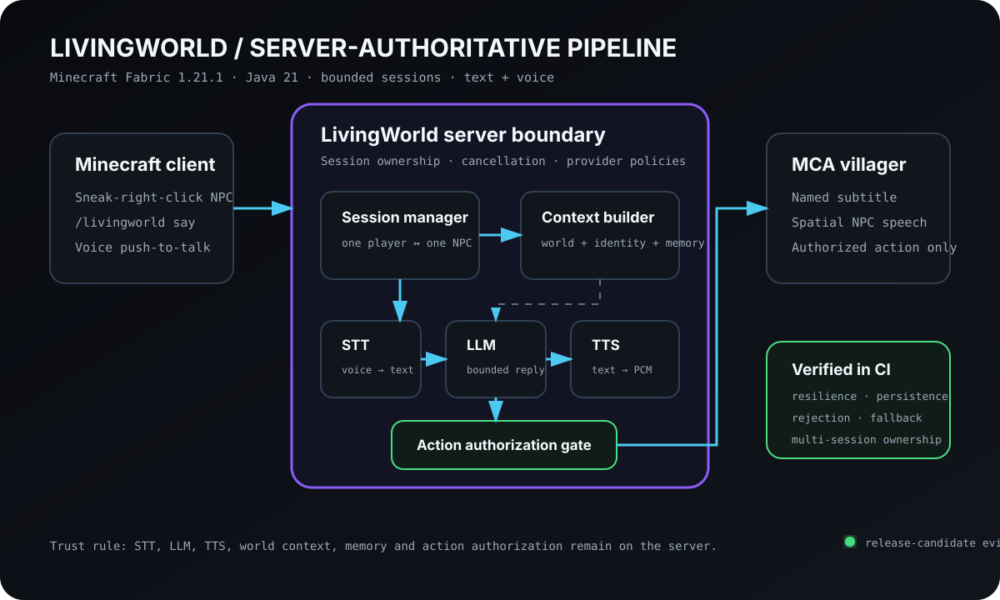
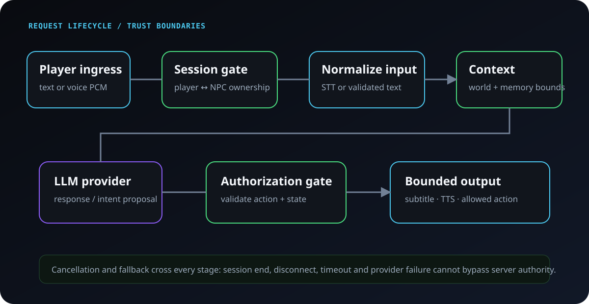

# LivingWorld — server-authoritative AI NPCs for Minecraft

**LivingWorld** — Fabric 1.21.1 mod, который даёт жителям MCA Reborn ограниченные русскоязычные AI-диалоги через текст и обычный push-to-talk Simple Voice Chat.

[Репозиторий на GitHub ↗](https://github.com/True-Ruslan/minecraft-botics-ai)



## Контекст

Главная проблема AI-NPC не в том, чтобы получить красивый ответ от LLM. Настоящая инженерная задача — удержать разговор и любые последствия под контролем игрового сервера:

- кто имеет право говорить с конкретным NPC;
- какой мировой контекст разрешено передать модели;
- что сохраняется в памяти;
- какие действия можно выполнить в мире;
- как отменить запрос при завершении сессии или отключении игрока;
- как система ведёт себя при отказах STT, LLM или TTS.

LivingWorld построен вокруг правила: **сервер является источником истины для сессии, контекста, памяти и действий**.

## Player flow

1. Игрок приседает и кликает по живому MCA-жителю в радиусе восьми блоков.
2. Сервер создаёт эксклюзивную сессию `player ↔ NPC`.
3. Игрок использует `/livingworld say` или стандартную кнопку push-to-talk Simple Voice Chat.
4. Голосовые пакеты принимаются только при активной серверной сессии.
5. Ответ отображается как подписанный subtitle и, при успешном TTS, звучит пространственно от NPC.
6. `/livingworld end` завершает сессию и отменяет связанные операции.

Один игрок может владеть одной NPC-сессией, а один NPC не может одновременно разговаривать с несколькими игроками.

## Архитектурные границы

### Session ownership

Сессия не выводится из факта получения voice packet. Сначала сервер подтверждает, что игрок действительно владеет разговором с конкретным NPC. Это не позволяет использовать голосовой канал как обход авторизации.

### Context and memory

В prompt попадает не произвольное состояние Minecraft, а собранный сервером ограниченный контекст: идентичность NPC, допустимые сведения о мире и сохранённая память разговора.

### Provider pipeline

```text
voice PCM → STT → validated text → LLM → bounded response → TTS PCM
text command ────────────────────┘
```

Каждый provider-этап имеет fallback/cancellation boundary. Неудача TTS не должна уничтожать уже готовый текстовый ответ, а сбой внешнего provider не должен оставлять сессию в неопределённом состоянии.

### Action authorization

LLM не получает прямого доступа к игровому миру. Любое потенциальное действие проходит отдельный authorization gate и серверную валидацию.

## Request lifecycle как trust-boundary sequence



На схеме важна не последовательность API-вызовов сама по себе, а смена доверительных зон:

1. player input сначала проходит session ownership;
2. voice превращается в нормализованный text input, а не идёт напрямую в game logic;
3. context/memory собираются сервером;
4. LLM выдаёт response или intent, но не authoritative action;
5. любой action проходит отдельную validation/authorization границу;
6. cancellation и fallback пересекают весь pipeline.

Таким образом prompt injection, provider failure или устаревший async response не должны автоматически становиться изменением игрового мира.

## Release baseline

- Minecraft Java `1.21.1`;
- Java `21`;
- Fabric Loader `0.19.3`;
- Fabric API `0.116.14+1.21.1`;
- MCA Reborn `7.7.22+1.21.1`;
- Simple Voice Chat `1.21.1-2.6.20` / API `2.6.20`;
- LivingWorld `0.1.0` common JAR для клиента и сервера.

Проект находится в состоянии **local release candidate**, а не опубликованного server release.

## Что проверяет CI

Pipeline использует Java 21 и pinned artifacts MCA Reborn / Simple Voice Chat. Он проверяет:

- unit и package tests;
- reproducibility;
- Fabric game tests;
- multi-actor resilience scenarios;
- persistence и restart behavior;
- action/injection rejection;
- cancellation и fallback paths;
- server lifecycle;
- synthetic PCM и provider contracts;
- Simple Voice Chat runtime binding;
- multi-session ownership.

Успешная сборка публикует временный JAR artifact и SHA-256 checksum. Version tags могут публиковать тот же проверенный JAR в GitHub Releases.

## Честная граница готовности

Автоматизация не заменяет реальную двухклиентную проверку. До deployment на friends/staging server остаются обязательными:

- два совпадающих реальных клиента;
- реальные микрофоны;
- оценка качества русского STT;
- human-audible positional speech;
- provider degradation/recovery;
- backup и rollback rehearsal.

Для этого в проекте поддерживается отдельный exact-JAR acceptance runbook.

## Почему этот проект важен

LivingWorld объединяет backend-подход и game integration:

- серверную авторитетность;
- конкурентное владение ресурсом;
- внешние AI/voice providers;
- persistent state;
- security boundaries;
- deterministic packaging и release evidence.

Это не «чат-бот внутри Minecraft», а ограниченная агентная система, встроенная в многопользовательский игровой runtime.
