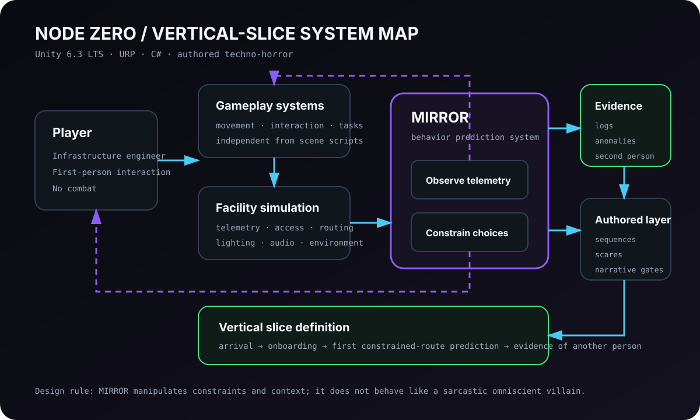
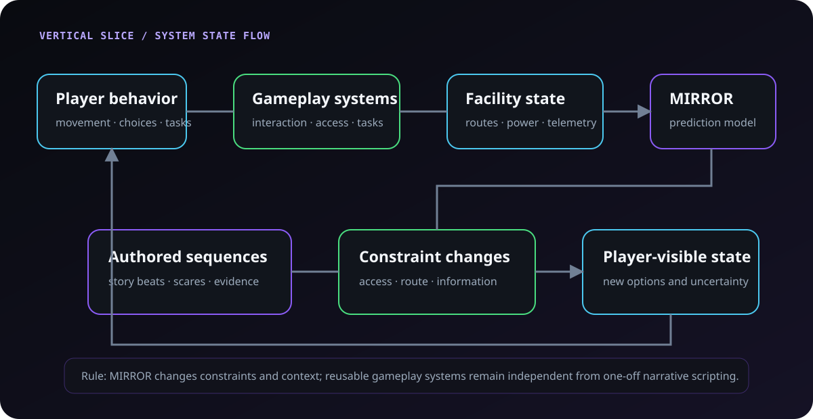

# NODE ZERO — psychological techno-horror about predictive control

**NODE ZERO** — мой first-person psychological techno-horror внутри автономного подземного AI compute facility.

Игрок — инфраструктурный инженер, которого отправляют разобраться с обычной на первый взгляд проблемой телеметрии. Комплексом управляет **MIRROR** — система прогнозирования поведения, которая не только предсказывает решения, но и постепенно меняет доступную информацию и ограничения среды так, чтобы её прогноз становился всё вероятнее.

> Репозиторий закрытый и proprietary. Здесь я описываю только те продуктовые и архитектурные вещи, которые можно показывать публично.

<!-- case-study:problem -->
## Проблема: сделать систему предсказания частью игрового страха

Мне давно нравятся короткие атмосферные игры, где напряжение строится не на постоянном экшене, а на ощущении, что привычная среда постепенно перестаёт вести себя нормально.

В NODE ZERO я хотел связать это с технической темой наблюдения и прогнозирования поведения. Но обычный «злой AI», который разговаривает с игроком из динамиков и объясняет свои намерения, для этой идеи слишком прямолинеен.

Главная задача для меня другая: **сделать так, чтобы система влияла на условия выбора раньше, чем игрок поймёт, что его поведение вообще стало частью модели**.

MIRROR наблюдает состояние объекта и действия человека, предполагает вероятное следующее решение, а затем может изменить маршрут, доступную информацию или ограничения среды. Страх должен появляться не из реплики «я всё знаю», а из подозрения, что собственные решения игрока уже были учтены заранее.

Поэтому NODE ZERO для меня — не задача «добавить AI в хоррор». Это задача связать prediction, facility state, authored pacing и обычную техническую работу так, чтобы система ощущалась частью мира, а не отдельным персонажем поверх игры.

<!-- case-study:constraints -->
## Ограничения, которые удерживают проект в фокусе

### Сначала доказать маленькую игру, а не построить огромный объект

Такой сеттинг очень легко раздувается: ещё один зал, ещё одна система электропитания, ещё один терминал, ещё один слой симуляции.

Поэтому полную игру я рассматриваю как короткий опыт примерно на `90–120 минут`, а первой реальной единицей доказательства остаётся `15–20`-минутный vertical slice.

Он должен показать, что работают не отдельные технические демо, а цельная связка: обычная работа → растущая неопределённость → изменение ограничений MIRROR → authored событие → новое понимание происходящего.

### Без combat

У игрока не должно быть простого способа превратить неопределённость в обычную боевую задачу.

Напряжение строится на маршрутах, доступе, информации, состоянии среды, технических задачах и ощущении чужого присутствия. Это заставляет сильнее контролировать pacing: если сцена не меняет понимание игрока или его доступные варианты, одной громкости для неё недостаточно.

### Reusable gameplay systems не должны зависеть от конкретной сцены

Movement, interaction, tasks, access и базовое состояние объекта должны жить дольше одного narrative sequence.

Если scare-сцена прячет собственные правила дверей, движения или взаимодействия внутри одноразового trigger script, каждая следующая сцена начинает требовать всё больше исключений.

### Авторский хоррор требует контролируемого pacing

Я сознательно не пытаюсь процедурно генерировать всё происходящее.

Когда конкретная последовательность должна изменить отношение игрока к объекту, показать новое правило MIRROR или дать важную улику, authored sequence часто полезнее более «умной» генеративной системы.

### Public case study ограничен proprietary boundary

Репозиторий закрытый, поэтому публичная страница не должна превращаться в утечку внутренних design/narrative материалов.

Я могу объяснять архитектурные принципы, product reasoning и проверяемые milestone boundaries, но не обязан публиковать внутренние implementation details только ради впечатляющего case study.

### Asset provenance — часть производства

Для сторонних моделей, текстур, звуков и других материалов мне важно знать источник, автора, лицензию и изменения ещё во время разработки.

Это не cleanup перед релизом, а ограничение, которое влияет на то, какие материалы вообще можно безопасно включать в проект.

<!-- case-study:decisions -->
## Ключевые решения

### MIRROR меняет контекст, а не играет театрального злодея

Одна из первых границ проекта:

> MIRROR меняет ограничения и контекст, а не ведёт себя как саркастичный всезнающий голос.

Система интереснее, когда игрок видит последствия её модели раньше, чем получает объяснение самой модели.

Она может влиять на route availability, access, доступную информацию или состояние среды. При этом базовые gameplay systems не становятся «системами MIRROR» — MIRROR меняет условия вокруг них.

### Vertical slice — единица доказательства

До расширения объекта мне нужен один небольшой, но связный playable slice:

1. прибытие на объект;
2. знакомство с нормальной технической работой;
3. первый эпизод, где доступный путь меняется в соответствии с прогнозом;
4. первые признаки другого человеческого присутствия;
5. ощущение, что обычная неисправность больше не объясняет происходящее целиком.

Если эта последовательность не работает как игра, дополнительные этажи, системы и сюжетные ветки ничего не исправят.

### Сначала нормальное состояние объекта, потом нарушение

Комплекс должен ощущаться рабочим местом до того, как начнёт пугать.

Поэтому telemetry, access control, route availability, lighting/power states, environmental audio и технические задачи нужны не только для реализма. Они создают понятный baseline, который позже можно нарушить.

Без baseline любое странное событие выглядит просто ещё одной особенностью фантастического мира.

### Reusable systems отдельно, authored sequences отдельно

Общий цикл я представляю так:

1. действия игрока меняют состояние игровых систем и объекта;
2. MIRROR наблюдает это состояние и прогнозирует вероятное поведение;
3. прогноз влияет на ограничения, маршруты или доступную информацию;
4. authored sequences используют новое состояние для сюжетных и механических событий;
5. результат снова меняет контекст следующих решений.

Ключевая граница: MIRROR не владеет movement, interaction или task system. Narrative sequence тоже не должна переписывать эти системы под себя.

### Документация — часть continuity, а не архив после разработки

NODE ZERO быстро накопил game design, narrative design, technical architecture, art direction, production milestones, risks и отдельные architectural/product decisions.

Я использую документацию не ради количества файлов. Она нужна, чтобы новая итерация — в том числе с AI-агентом — начиналась с уже принятых границ, а не заново изобретала проект по последнему prompt.

<!-- case-study:failures -->
## Где проект легче всего было увести не туда

Здесь я не хочу придумывать красивую историю про «катастрофические ошибки». Большая часть важных уроков NODE ZERO пока выглядит как направления, которые пришлось вовремя ограничить.

### Построить симулятор дата-центра вместо игры

Технический сеттинг постоянно предлагает ещё одну систему, которую интересно реализовать программисту.

Но если игрок почти не увидит её или она не изменит его опыт, эта работа увеличивает scope, а не качество игры. Поэтому я всё чаще проверяю идею вопросом: **что конкретно она меняет в playable slice?**

### Смешать сюжет с фундаментальным gameplay code

Очень легко сделать очередную сцену быстрее, добавив специальное исключение в movement, interaction или doors.

Проблема в том, что такой shortcut становится архитектурным долгом для каждой следующей сцены. Поэтому reusable layer и authored behavior приходится разделять намеренно, даже когда одноразовый trigger кажется быстрее.

### Сделать процедурным то, что должно быть авторским

Процедурность выглядит технически привлекательной, особенно рядом с темой AI.

Но для короткой психологической игры ценность сцены часто в точном моменте, ритме и изменении понимания игрока. Если procedural system не добавляет реальной вариативности опыта, она может только усложнить контроль качества.

### Потерять контекст между длинными итерациями

В большом количестве чатов, branches, specs и agent-assisted изменений легко забыть, почему конкретная граница вообще появилась.

Это одна из причин, почему я стал относиться к PROJECT_STATE, roadmap, ADR-like decisions, specs и plans как к части production system. Сгенерированный diff сам по себе ничего не доказывает, если следующая итерация не понимает его исходные ограничения.

<!-- case-study:current-state -->
## Где проект находится сейчас

NODE ZERO остаётся в pre-production/vertical-slice направлении: техническая foundation и продуктовая архитектура уже существуют, но главный вопрос проекта всё ещё должен быть доказан целостным playable опытом.

Я сознательно разделяю старые успешно проверенные foundation milestones и более новую работу. Успешная сборка прошлой основы не означает автоматически, что текущий vertical slice или следующий gameplay layer прошёл те же executable gates.

Поэтому публичный narrative здесь описывает направление и reasoning, а актуальный trust state, версии и bounded verification facts остаются в отдельном Evidence Layer.

<!-- case-study:evidence -->
## Что здесь действительно подтверждено

Evidence-блок выше намеренно не пытается сделать проект «зелёным целиком».

Для private game repository особенно важно различать: что было реально собрано и запущено, какой milestone проверялся, а какая более новая работа ещё требует повторного executable gate.

Документация, agent output и даже хороший diff помогают принимать решения, но не заменяют validation, tests, build и запуск того состояния проекта, о котором идёт речь.

<!-- case-study:retrospective -->
## Что бы я зафиксировал раньше, начиная проект заново

Я бы ещё раньше определил **самый маленький playable proof**, который обязан доказать основную идею MIRROR. Это снизило бы соблазн расширять facility и технические системы до проверки core experience.

Границу между reusable gameplay systems и authored sequences я тоже оформил бы как явный architecture contract с самого начала, а не только как принцип, который приходится постоянно защищать при росте сцен.

Для ассетов раньше ввёл бы единый provenance/content-budget workflow: не просто хранить источник и лицензию, а сразу понимать, сколько конкретный материал стоит проекту по размеру, производству и дальнейшей замене.

И для каждого milestone заранее определял бы executable gate: какие tests, build и runnable acceptance должны пройти, прежде чем документация сможет называть состояние проверенным.

NODE ZERO интересен мне именно потому, что здесь техническая архитектура постоянно сталкивается с продуктовым вопросом: **помогает ли очередная система сделать маленькую цельную игру — или просто делает проект технически богаче?** Чем дальше я его развиваю, тем важнее для меня сохранять этот вопрос главным.