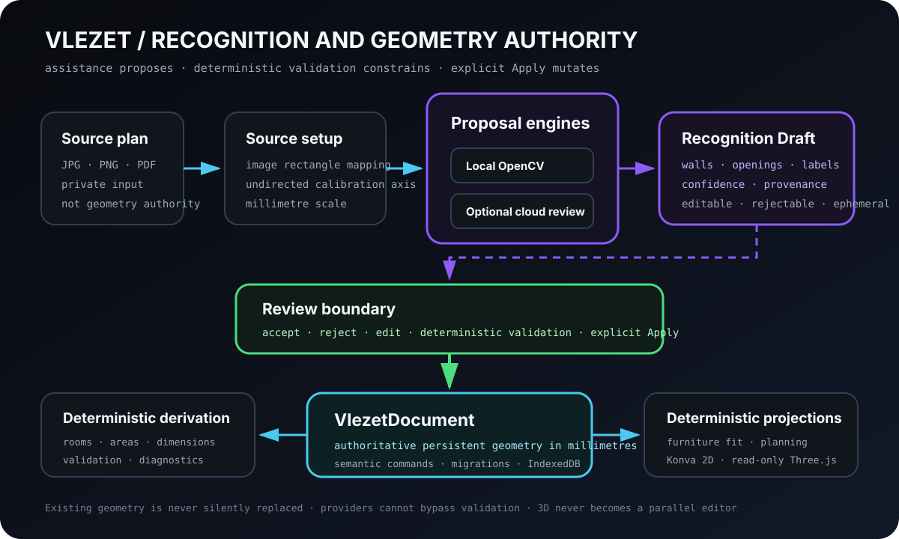

# Vlezet — точная планировка квартиры без CAD

**Vlezet** — мой local-first конструктор планировок, в котором реальную квартиру можно собрать из стен, проёмов и мебели, проверить размеры и площади, посмотреть схему в 3D и использовать распознавание плана как редактируемую помощь, а не как источник истины.

[Репозиторий на GitHub ↗](https://github.com/True-Ruslan/vlezet)



<div data-tr-project-timeline="vlezet"></div>

<!-- case-study:problem -->
## Проблема: план квартиры должен оставаться точным после первого впечатления

Первый прототип планировщика сделать сравнительно легко: дать пользователю нарисовать прямоугольник, поставить диван и показать примерную площадь.

Реальная квартира быстро разрушает такую упрощённую модель. У стены есть ось и толщина. У проёма — ширина, положение на конкретной стене и направление открывания. Комната появляется не потому, что пользователь нарисовал цветной полигон, а потому, что стены действительно образовали замкнутую топологию. Мебель может визуально помещаться и одновременно перекрывать дверь или оставлять непроходимый зазор.

Импорт фотографии или PDF добавляет ещё один источник неопределённости. Изображение может быть повёрнуто, иметь поля, перспективу, подписи, размерные линии, сантехнику, мебель и дверные дуги. Даже корректный JSON от LLM не означает, что восстановленные стены совпадают с реальным планом.

Поэтому Vlezet для меня стал задачей не про «красиво нарисовать квартиру», а про сохранение геометрической истины на всём пути: от исходного изображения до площади комнаты, расстановки мебели и 3D-проекции.

Основной принцип сформулировался так:

> Распознавание может предложить геометрию. Авторитетной она становится только после проверки, детерминированной валидации и явного Apply в общий документ.

<!-- case-study:constraints -->
## Ограничения, которые определили архитектуру

### Миллиметры — единственная постоянная единица мира

Canvas-пиксели зависят от zoom, viewport и плотности экрана. Persistent model хранит миллиметры, а Konva, Three.js, размеры на экране и PNG-экспорт только проецируют эту модель.

### Один документ вместо нескольких параллельных истин

`VlezetDocument` владеет стенами, проёмами, объектами и versioned persistence. Комнаты, площади, размеры, 3D meshes и fit-диагностика выводятся из него.

Recognition Draft, planning Preview, UI-фильтры, подсветка и evidence остаются временными. Они не должны незаметно создавать второй проект рядом с основным.

### Existing geometry нельзя молча заменить

Локальный CV и cloud review не получают права очистить уже нарисованную квартиру. Кандидаты можно принять, отклонить или исправить, а изменение документа происходит только через явную операцию Apply.

### AI не создаёт недостающую геометрию

Cloud review получает exact local IDs и координаты. Он может подтвердить или отклонить существующего кандидата и скорректировать confidence evidence, но не имеет права добавить новую стену, переместить линию или вернуть unbounded geometry.

### 3D остаётся проекцией

Three.js-визуализация read-only. У неё нет собственного набора координат, furniture-fit state или редактора проёмов. Любая правка возвращается в общий 2D/domain command path.

<!-- case-study:decisions -->
## Ключевые решения

### Framework-independent geometry authority

Доменная модель, вычисления и semantic history живут ниже React, Konva и Three.js. Это позволяет проверять топологию и размеры без браузера, а renderer менять без миграции persistent geometry.

### Semantic commands вместо snapshot-истории интерфейса

Undo/Redo хранит смысл операций: добавить стену, изменить толщину, применить проверенный набор кандидатов, изменить параметры проёма. Один Apply можно отменить одним шагом, даже если внутри он добавил несколько сущностей.

### Furniture fit опирается на общую геометрию

Fit определяют containment, collision, door zones и реальные расстояния между повёрнутыми контурами. UI показывает уже существующее детерминированное решение: статус размещения, кратчайший зазор, рекомендуемые зоны и причины конфликта.

### Recognition Draft — отдельная стадия доверия

Распознавание разделено на этапы:

1. пользователь загружает JPG, PNG или PDF;
2. изображение калибруется по реальному размеру;
3. local CV создаёт bounded candidates;
4. при необходимости cloud review проверяет только существующие IDs;
5. пользователь сравнивает Draft с источником;
6. deterministic validation отбрасывает недопустимые связи;
7. только Apply переводит принятые кандидаты в ordinary document entities.

### Сначала benchmark, потом tuning

M7.8A добавил versioned public-safe corpus, Core и Source execution, TP/FP/FN overlays и метрики для геометрии стен, топологии, проёмов, комнат, площадей, confidence и reconciliation.

Benchmark не заменяет product-owner source. Он делает изменение воспроизводимым, но отдельный реальный план проверяет, не научилась ли система проходить fixtures, сохранив неправильное поведение на настоящем документе.

### Region-first extraction вместо line-first шума

M7.8B перевёл локальное распознавание к region-first обработке толстых архитектурных областей. Canny/Hough остался bounded fallback, а не главным владельцем результата.

Candidate overload теперь завершается fail-closed: перегруженный Draft не сохраняется, не отправляется в AI и не получает право на Apply. Это важнее попытки вернуть пользователю убедительную, но загрязнённую сеть линий.

<!-- case-study:failures -->
## Что пришлось понять через ошибки

### Лупа и калибровка смотрели не в ту систему координат

На широком изображении Canvas содержал letterbox-поля. Курсор, magnifier, маркеры и calibration line вычислялись относительно всей stage, а не фактически отрисованного image rectangle.

Исправление потребовало единого преобразования координат через rendered image bounds и запрета принимать клики по полям.

### Направление A → B не должно было переворачивать план

Для горизонтальной или вертикальной calibration line важна ось, а не порядок концов. Калибровка стала undirected axis, поэтому обратный выбор точек больше не поворачивает сохранённый план примерно на 180°.

### OpenCV возвращал больше линий, чем читала программа

`HoughLinesP` в OpenCV.js отдаёт координаты плоскими группами `x1, y1, x2, y2` в `data32S`. Предыдущая итерация по `lines.rows` забирала лишь небольшую часть результата. Чтение всех coordinate groups исправило потерю линий, но одновременно показало следующую проблему: полный raster содержит не только стены.

### Первый real-plan review выявил symbol network вместо shell

На representative clear plan ранняя M7.8B-реализация сформировала 417 local wall candidates, ноль проёмов и связанную сеть символов, мебели и подписей. AI review сохранил загрязнённую сеть и добавил неподтверждённые длинные линии.

Этот результат не был скрыт за зелёным benchmark. Он стал входом для corrective iteration: region-first structural mask, bounded fallback, candidate budget, sanitization восстановленного Draft и запрет cloud-only geometry.

После повторной проверки M7.8B был принят product owner с известными ограничениями точности. На representative source система вернула:

```text
local wall candidates: 27
confirmed after AI:     19
remaining for review:   8
openings:               0 — deferred to M7.8C
```

Принятый Source geometry F1 и Source topology F1 составили `0.837989`. Это измеримый прогресс, но не доказательство точного распознавания любого плана.

### Валидный AI-ответ может быть пространственно неправильным

Response healing и JSON Schema исправляют protocol defects. Они не доказывают, что стена находится там же, где на изображении. Поэтому unknown IDs, moved coordinates, cloud-only walls, unbounded lines и overloaded responses отклоняются до product state.

### Проём нельзя принимать без стены-хозяина

Gap в линии может быть дверью, окном, текстом или артефактом edge detection. M7.8B намеренно оставил openings равными нулю, вместо того чтобы показать уверенный проём без verified host wall.

<!-- case-study:current-state -->
## Где проект находится сейчас

В `main` Vlezet приняты и смержены milestones **M0–M7.8B**.

Уже работают:

- стены, топология, комнаты, проёмы, размеры и площади в миллиметрах;
- мебель, exact transforms и collision/door/clearance diagnostics;
- semantic Undo/Redo;
- local projects, autosave, backup, import/export и PNG;
- reference-plan import, calibration и tracing;
- editable local/OpenRouter candidates с explicit Apply;
- deterministic read-only 3D projection;
- bounded planning alternatives с Preview и revalidated atomic Apply;
- responsive editor shell, inspectors, onboarding и furniture-fit workflow;
- versioned recognition benchmark;
- M7.8B region-first wall extraction, bounded topology и verification-only AI.

M7.8B принят с известными ограничениями:

- некоторые внешние или основные стены всё ещё могут быть пропущены либо фрагментированы;
- confidence classification не идеальна;
- Source topology F1 остаётся ниже финальной цели M7.8 `0.90`;
- perspective-photo recognition не решён;
- stronger providers подтверждают больше существующих candidates, но не создают missing geometry.

Текущий slice — **M7.8C Opening Classification and Host-Wall Validation**. Его задача — классифицировать door/window/unknown hypotheses, привязать каждый accepted opening к известной стене и оставить неоднозначные случаи pending или rejected.

После host-wall correctness можно переходить к room-face derivation, OCR labels, area constraints и confidence calibration.

<!-- case-study:evidence -->
## Что подтверждено, а что остаётся гипотезой

<div data-tr-project-evidence="vlezet"></div>

Evidence разделяет три уровня:

- принятый product workflow и deterministic geometry contracts;
- reproducible benchmark authority;
- M7.8B product-owner acceptance с точными метриками и явно сохранёнными ограничениями.

Статус `verified` относится только к перечисленным scopes. Он не означает, что Vlezet уже распознаёт произвольный архитектурный план без ручной проверки.

<!-- case-study:retrospective -->
## Что бы я сделал иначе, начиная проект сегодня

Я бы раньше записал `VlezetDocument` и миллиметры как формальный authority contract. После этого многие решения становятся проще: Canvas — проекция, комнаты — derivation, 3D — read-only, Preview — ephemeral, Apply — semantic command.

Recognition benchmark я тоже построил бы до первого quality tuning. Но M7.8B добавил ещё одно правило: public benchmark и representative product-owner source должны оставаться разными обязательными gates.

Ещё раньше я бы разделил четыре проверки:

1. provider вернул ответ;
2. ответ прошёл protocol validation;
3. candidates прошли deterministic domain validation;
4. геометрия похожа на источник и принята человеком.

Наконец, uncertainty нужно проектировать как часть продукта. Пользователю полезнее увидеть среднюю уверенность, неизвестную стену-хозяина и возможность исправить Draft, чем получить чистую картинку, которая молча врёт о квартире.

Vlezet остаётся проектом про согласование нескольких представлений одной реальности: изображения, математической геометрии, понятного интерфейса, распознавания, мебели и 3D. Надёжность появляется только тогда, когда у всех этих слоёв есть одна явная граница истины.
